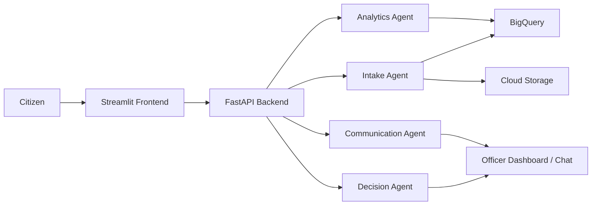

# VoxCivic Architecture

VoxCivic is designed as a modular platform that turns raw civic complaints into structured intelligence for municipal decision-makers.

## 1. High-level architecture

The system has three major layers:

1. Frontend layer
   - Streamlit UI for complaint submission
   - officer dashboard and AI chat experience

2. Application / agent layer
   - FastAPI backend
   - Google ADK-powered agents for intake, analytics, decision support, and communication

3. Data and infrastructure layer
   - BigQuery for structured complaint data
   - Cloud Storage for uploaded images
   - Cloud Run for backend deployment
   - optional GPU-based RAPIDS/cuDF analytics path

## 2. End-to-end flow



## 3. Component responsibilities

### Frontend

- Submit a complaint with text and optional image
- View officer dashboard KPIs and charts
- Ask natural language questions to the assistant

### Intake agent

- receives citizen input
- extracts structured categories, severity, summary, and department mapping
- checks likely duplicates
- prepares data for storage

### Analytics agent

- examines complaint history and trends
- detects spikes in severity
- groups issues by ward or category
- uses RAPIDS/cuDF when available for faster processing

### Decision agent

- prioritizes issues by severity, frequency, location, and public impact
- recommends the next action for field teams
- highlights urgent wards or departments

### Communication agent

- generates work-order summaries
- creates follow-up responses for officers
- answers natural-language operational questions

## 4. Storage and persistence model

- BigQuery stores structured complaint records, categories, severity, ward, department, and status
- Cloud Storage stores uploaded images and optional media files
- The backend keeps a lightweight local fallback store for local development and hackathon demos

## 5. Deployment topology on Google Cloud

- Backend service: Cloud Run
- Frontend service: Cloud Run or a hosted Streamlit frontend for demo purposes
- Data services: BigQuery and Cloud Storage
- AI services: Gemini / Vertex AI access
- Optional acceleration: GPU-enabled container environment for RAPIDS/cuDF

## 6. Repository structure

```text
voxcivic/
├── backend/
│   ├── agents/
│   ├── models/
│   ├── tools/
│   ├── config.py
│   ├── main.py
│   └── requirements.txt
├── frontend/
│   ├── pages/
│   ├── app.py
│   ├── utils.py
│   └── requirements.txt
├── data/
│   └── schema.sql
├── docker/
│   ├── Dockerfile.backend
│   └── Dockerfile.frontend
├── architecture.md
├── readme.md
└── setup_deployment.md
```

## 7. Why this design works for the hackathon

- It is modular and easy to explain in a demo
- It shows real AI + cloud integration, not just a static prototype
- It can be incrementally improved with real Google Cloud credentials and production-grade orchestration
- It supports both local development and cloud deployment